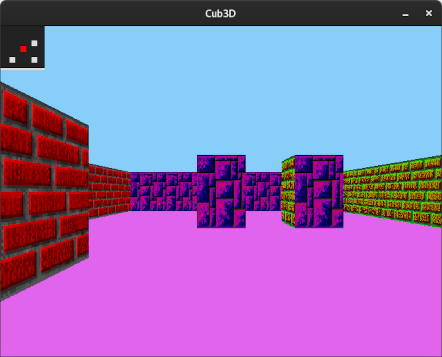

# Cub3D

The goal of the Cub3D project is to create a 3D maze game inspired by Wolfenstein 3D, using the Ray-Casting technique and 42's graphic library.

## Project Description

In this project, you will create a simplified version of a game engine. The main objective is to familiarize yourself with computer graphics, optimization issues, and game dynamics. You will have to create a dynamic view inside a maze from a first-person perspective, using the Ray-Casting technique.

## Game Rules

- The player's objective is to navigate through a maze and reach the exit while avoiding obstacles and enemies.
- The player can move forward, backward, and sideways, as well as rotate the view to look around.
- Walls, doors, and other obstacles must be displayed realistically, with proper textures and shading.

## Creating Your Map

To create your own map for Cub3D, you need to add a `.ber` file to the `maps` folder. Additionally, you must specify the paths to the images, the color codes for the ceiling and floor, and describe the map layout. Here's an example:

```plaintext
NO ./images/north_side.xpm
WE ./images/west_side.xpm
SO ./images/south_side.xpm
EA ./images/east_side.xpm
F 225, 100, 236
C 135, 206, 250

11111111111111111111
10000000000000000001
10000000000000010001
10001000000000000001
10000000000100000001
100010000W0000000111
10000000000000000001
10000001000100000001
10000000000000000001
11111111111111111111
```

## Compilation Example: Cub3D

To compile the `Cub3D` program, run:

```bash
make
./cub3D maps/correct_map.cub
```



## Conclusion

To delve deeper into the implementation of the program with raycasting, you can follow this [link](https://lodev.org/cgtutor/raycasting.html).

For further insights into the `minilibx` graphic library and its usage, you can refer to this [link](https://aurelienbrabant.fr/blog/getting-started-with-the-minilibx).

